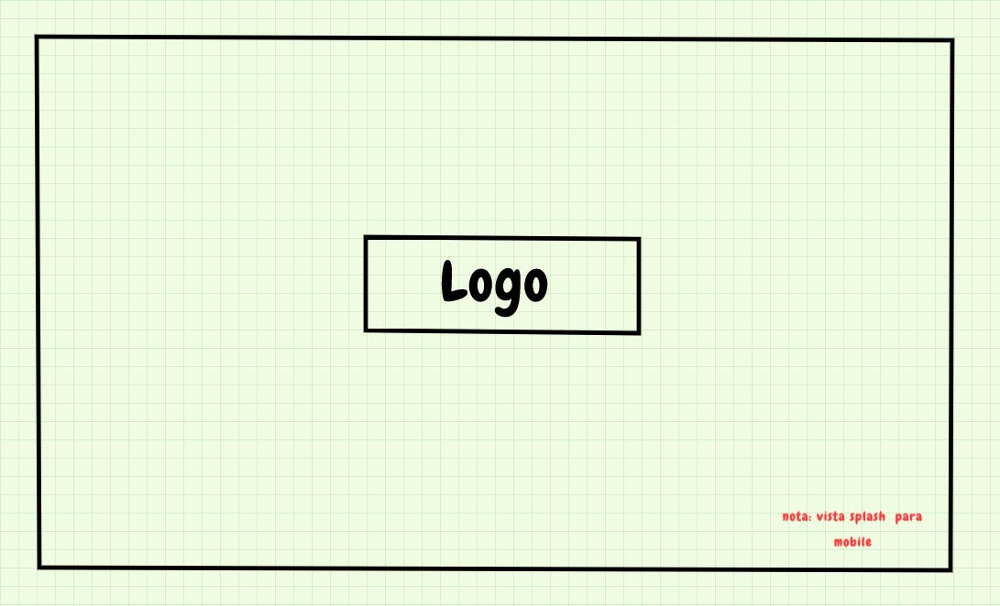
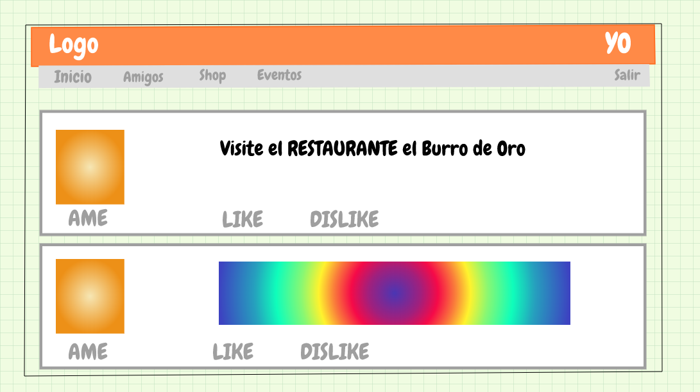
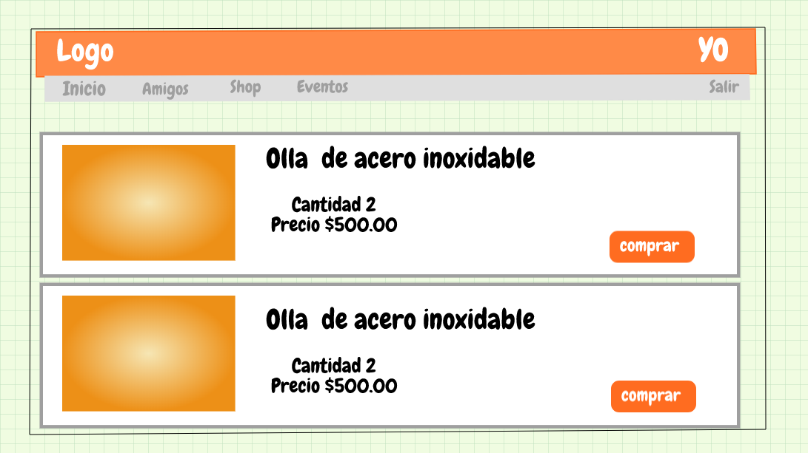
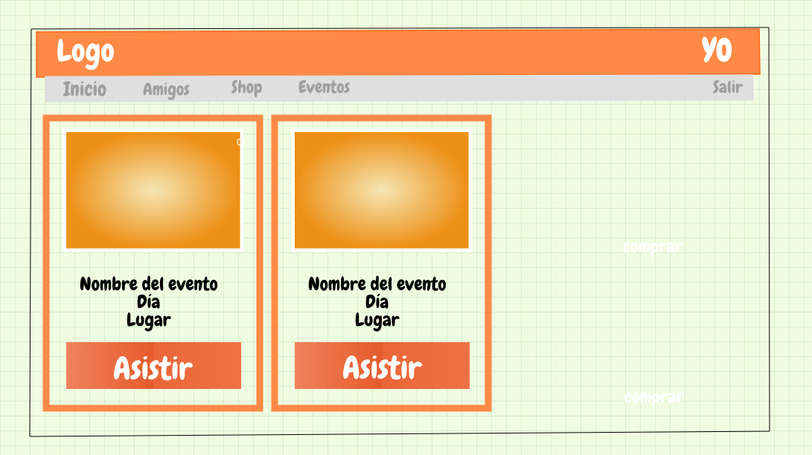
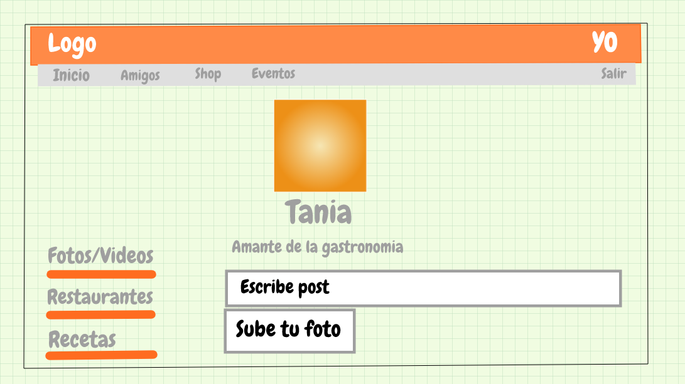

# SOBRE EL PRODUCTO

Instagram, Snapchat, Twitter, Facebook, Twitch, Linkedin, las redes sociales han invadido nuestra vida. Las amamos, odiamos, idolatramos y muchos no podemos vivir sin ellas. Dado este contexto, un emprendedor muy visionario nos ha encargado crear una red social. No nos da mucho detalle sobre qué tipo de red social quiere, él solo nos dice que creemos la que mejor podamos y que luego lo convenzamos de que nuestra red social será la más exitosa.

Para él hay algunos puntos básicos que debe tener una red social:

- Perfiles de usuarios
- Un newsfeed donde puedes ver las actualizaciones de todos tus contactos
- Un lugar donde poder escribir posts
- Un lugar para subir fotos
- Capacidad para poder tener amigos o para poder seguir a personas/marcas dentro de la red social
- Ser mobile friendly

# UX

Se realizó un investigación previa a la realización de la Red Social Food Lovers, para respladar la idea del porque crear una Red Social enfocada a la comida.

Food Lovers es una Red Social dirigida a un publico general que guste de utilizar redes sociales, sus pricipales usuarios son personas de un grupo conocido como foddies.

“Foodie” es un termino actual con el cual una persona se describe como fanatica del comer y del beber, no es como el termino de un “Gourmet” el cual esta relacionado con la buena vida y estilos en general. Los Foodies son grupos especializados que buscan la buena comida y el buen beber no necesariamente en los lugares mas lujosos y conocidos.

Más información http://www.lavanguardia.com/20131004/54388403009/foodies-pasion-por-la-comida.html

Basados en tendencias del publico foddie, Food Lovers te permite crear una red social de amigos con un interes principal de recomendar y calificar restaurantes, Agregar y encontrar Recetas, Subir y ver fotos de comida.

El valor agragado a nuestra aplicacion se encuentra en la seccion de shop la cual permite al usuario comprar utencilios y productos referentes con la cocina y una porporcion de las ganancias obtenidas seran donadas a fundaciones contra el hambre.

https://www.accioncontraelhambre.org/es

Con base a los datos obtenidos de una encuesta realizada a diferentes ususarios, probamos que las personas en verdad les gustaria ayudar en diferentes causas, y que la idea de que por medio de una red social puedas ayudar aparte de tener una funcionalidad que sirve para conocer recomendaciones de restaurantes, recetarios y crear comunidad da un mayor impacto que el simple hecho de pertenecer a una red social que talvez los intereses no son ayudar.

## sketch

.jpeg)

.png)
